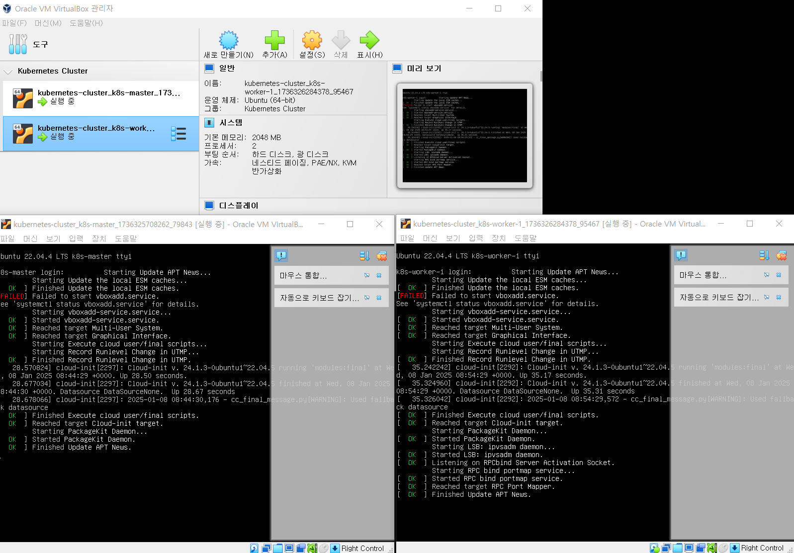

# Kubernetes cluster
Kubeadm으로 Kubernetes 클러스터를 구성을 위한 vagrant 스크립트

> [Container Runtimes](https://kubernetes.io/docs/setup/production-environment/container-runtimes/)  
> [Installing kubeadm](https://kubernetes.io/docs/setup/production-environment/tools/kubeadm/install-kubeadm/)  
> [Installing kubeadm, kubelet and kubectl](https://kubernetes.io/docs/setup/production-environment/tools/kubeadm/install-kubeadm/#installing-kubeadm-kubelet-and-kubectl)  
> [[K8S] Kubernetes 설치 (VirtualBox+Vagrant+K8S:v1.31)](https://tack0829.tistory.com/8)   

## 적용 Components (굵은 글씨) 및 Version 
### Image: [bento/ubuntu-22.04](https://portal.cloud.hashicorp.com/vagrant/discover/bento/ubuntu-22.04)
### Core
   * Docker Version: 20.10.7~3-0 
   * **containerd** v1.4.6 :: recommaned
   * cri-o v1.21 (experimental: see CRI-O Note. Only on fedora, ubuntu and centos based OS)
   * **Kubelet** Version: 1.32.0-1.1
   * **Kubectl** Version: 1.32.0-1.1
   * **Kubeadm** Version: 1.32.0-1.1
   * **Kubernetes-cni** Version : 1.6.0-1.1


### Network Plugin
   * cni-plugins v0.9.1
   * CNI: Flannel (Latest Version), **calico** v3.29.1

### 커뮤니티 주도의 새로운 Kubernetes 패키지 저장소
   * pkgs.k8s.io

## Pre-requisites

 * **[Vagrant 2.4.3](https://www.vagrantup.com)**
 * **[Virtualbox 7.0.18](https://www.virtualbox.org)**  -> 현재(2025.01.07) vagrant 에서 지원하는 버전
 * **[Discover Vagrant Boxes](https://app.vagrantup.com/boxes/search)**  

#### python core 설치
- VirtualBox 설치 문제 해결
- Missing Dependencies Python Core / win32api 문제 해결
- Python 을 통해 VirtualBox 를 제어하고자 하는 경우에 필요
```
pip install pywin32
```

### Dockershim은 쿠버네티스 릴리스 1.24부터 쿠버네티스 프로젝트에서 제거
#### containerd
- 환경 설정 파일 : /etc/containerd/config.toml
- systemd cgroup 드라이버 환경 설정하기
```
[plugins."io.containerd.grpc.v1.cri".containerd.runtimes.runc]
  ...
  [plugins."io.containerd.grpc.v1.cri".containerd.runtimes.runc.options]
    SystemdCgroup = true
```
- 재기동 : sudo systemctl restart containerd

#### CRI-O
#### 도커엔진
#### 미란티스 컨테이너 런타임

### 커뮤니티 주도의 새로운 Kubernetes 패키지 저장소
#### 새로운 저장소 정보
- 도메인: pkgs.k8s.io
- 지원 형식: Debian 및 RPM 패키지 모두 제공
- 인프라: CloudFront CDN과 S3 버킷 기반
- 플랫폼: OpenBuildService(OBS)를 통해 패키지 빌드 및 배포2
#### 주요 특징
- 저장소 구조에 대한 더 나은 통제 가능
- cri-tools, kubernetes-cni 등 종속성에 대한 세밀한 제어
- Kubernetes 사전 릴리스 패키지 게시 가능
- Release Manager가 직접 패키지 게시 가능3
#### 시간대별 변경사항
- 2023년 8월 15일: 새로운 커뮤니티 관리 패키지 저장소 발표
- 2023년 8월 31일: 기존 저장소 공식 지원 중단
- 2023년 9월 13일: 기존 저장소 동결
- 2024년 3월 4일: 기존 저장소 완전 제거4
#### 지원 버전
- Kubernetes v1.24.0 이상 버전부터 제공
- 각 Kubernetes 마이너 버전별로 전용 패키지 저장소 구조 채택

  


### Install the plugin for Vagrant to ability to use environment files.(and ...)
```
vagrant plugin install vagrant-env
vagrant plugin install vagrant-disksize
vagrant plugin install vagrant-vbguest
vagrant plugin install vagrant-hostmanager
vagrant plugin install vagrant-reload
vagrant plugin install vagrant-scp
vagrant plugin list
```
```
PS > vagrant plugin install vagrant-env
Installing the 'vagrant-env' plugin. This can take a few minutes...
Fetching dotenv-deployment-0.0.2.gem
Fetching dotenv-0.11.1.gem
Fetching vagrant-env-0.0.3.gem
Installed the plugin 'vagrant-env (0.0.3)'!
PS > 
```
```
PS > vagrant plugin list
vagrant-disksize (0.1.3, global)
vagrant-env (0.0.3, global)
vagrant-hostmanager (1.8.10, global)
vagrant-reload (0.0.1, global)
vagrant-scp (0.5.9, global)
vagrant-vbguest (0.32.0, global)
PS > 
```

### vagrant 명령어
| 명령어 | 설명 | 비고 |   
|:---|:---|:---|    
| vagrant status | 가상머신 상태확인 |  |  
| vagrant suspend | 가상머신 일시정지 |  |  
| vagrant resume | |  |  
| vagrant halt | 가상머신 중지 |  |  
| vagrant destroy |  가상머신 삭제 |  |  
| vagrant box list | 가상 머신 목록 확인 |  |  
| vagrant box remove _hasicorp/bionic64_ | 불필요한 가상머신 삭제 |  |  
| vagrant up | _Vagrantfile_ 에 적힌 내용에 따라 가상 머신 실행 | |  
| vagrant ssh | ssh 접속 | id:vagrant / pw:vagrant |   

### Vagrant 에서 사용할 환경변수 설정하기
- 환경변수 설정 파일 : `.env`
```bash
# Base Image
# IMAGE_NAME=ubuntu/xenial64
IMAGE_NAME=bento/ubuntu-22.04
BOX_VERSION=202407.23.0

# Resource Allocation
MEMORY_SIZE_IN_GB=2
CPU_COUNT=2

# Cluster Configuration
MASTER_NODE_COUNT=1
WORKER_NODE_COUNT=2
# APISERVER_IP="192.128.0.101"

# Network Configuration
MASTER_NODE_IP_START=192.128.0.10
WORKER_NODE_IP_START=192.128.0.20

# Kubernetes Network CIDR
CLUSTER_CIDR="10.128.0.0/16"
SERVICE_CIDR="10.128.0.0/16"
POD_CIDR="10.129.0.0/16"
```

## Vagrant 사용 파일
| 파일 | 설명 | 현재 구성 | 비고 |   
|:---|:---|:---:|:---|     
| .env | vagrant 사용 환경변수 | ○ | |  
| Vagrantfile | vagrant up 에 사용되는 기본 동작 정의 파일 | ○ | |  
| pre.sh | cluster 구성 시 필요한 도구 및 설정 구성 Script </br> iptable, 방화벽 설정 포함 | ○ | master, worker 공통 |  
| install-containerd.sh | CRI - containerd 설치 script | ○ | master, worker 공통 |  
| install-kube-tools.sh | k8s tool 설치 script | ○ | master, worker 공통 |  
| post.sh | 설치 후 정리 | ○ | master, worker 공통 |  
| init-master-node.sh | master node 구성 </br> - 초기화 </br> - k8s 사용 환경 설정 </br> - worker node join 을 위한 token 저장 - join.sh | ○ | |  
| init-worker-node.sh |worker node 구성 </br> join.sh 수행 및 kubelet 재기동 | ○ | |  
| prepare-k8s-config-for-vagrant.sh | vagrant user 용 k8s 환경 설정 | ○ | |  
| prepare-k8s-config.sh | root user 용 k8s 환경 설정 | ○ | |  
| install-cni-calico.sh | CNI - Calico 설치 script | ○ | |  
| install-cni-flannel.sh | CNI - flannel 설치 script | X |  |  
| install-docker.sh | CRI - docker 설치 script  | X |  |  
| install-helm.sh | k8s package manager helm 설치 script | X |  |  
| install-dashboard.sh | k8s dashboard 설치 script | X |  |  
| install-ingress-controller.sh | k8s nginx ingress controller 설치 script | X |  |  

## How to Run

Execute the following vagrant command to start a new Kubernetes cluster, this will start one admin(bastion server), one master and two nodes:

```
vagrant up
```

You can also start invidual machines by vagrant up k8s-head, vagrant up k8s-node-1 and vagrant up k8s-node-2

If more than two nodes are required, you can edit the servers array in the Vagrantfile

```
servers = [
    {
        :name => "k8s-master",
        :type => "node",
        :box => "ubuntu/xenial64",
        :box_version => "v20210804.0.0",
        :eth1 => "192.128.0.13",
        :mem => "2048",
        :cpu => "2"
    }
]
 ```

As you can see above, you can also configure IP address, memory and CPU in the servers array. 

## Clean-up

Execute the following command to remove the virtual machines created for the Kubernetes cluster.
```
vagrant destroy -f
```

You can destroy individual machines by vagrant destroy k8s-node-1 -f 

## SSH 접속

SSH 접속, 가상 머신 상태 확인, 중지 및 삭제
```
$ vagrant ssh
```

## 가상머신의 상태 보기
vagrant status
```
PS > vagrant status
Current machine states:

k8s-master                not created (virtualbox)
k8s-worker-1              not created (virtualbox)
k8s-worker-2              not created (virtualbox)

This environment represents multiple VMs. The VMs are all listed
above with their current state. For more information about a specific
VM, run `vagrant status NAME`.
PS > 
```

## FAQ
### Why Bento ?
- Because HashiCorp (the makers of Vagrant) recommends the Bento Ubuntu.

### Why are the versions fixed?
- Because major changes over the packages may broke the setup.

### **"Call to WHvSetupPartition failed"** : 오류 발생시 조치할 사항?
- **Hyper-V** 를 비활성화 함
  - RUN > CMD > bcdedit /set hypervisorlaunchtype off, then reboot your machine.

### **Hyper-V** 재 활성화 하기
- RUN > CMD > bcdedit /set hypervisorlaunchtype auto, then reboot your machine.

## windows kubectl 설치
```
choco install kubernetes-cli
```
```
Chocolatey v0.10.15
Installing the following packages:
kubernetes-cli
By installing you accept licenses for the packages.
Progress: Downloading kubernetes-cli 1.22.0... 100%

kubernetes-cli v1.22.0 [Approved]
kubernetes-cli package files install completed. Performing other installation steps.
The package kubernetes-cli wants to run 'chocolateyInstall.ps1'.
Note: If you don't run this script, the installation will fail.
Note: To confirm automatically next time, use '-y' or consider:
choco feature enable -n allowGlobalConfirmation
Do you want to run the script?([Y]es/[A]ll - yes to all/[N]o/[P]rint): Y

Extracting 64-bit C:\ProgramData\chocolatey\lib\kubernetes-cli\tools\kubernetes-client-windows-amd64.tar.gz to C:\ProgramData\chocolatey\lib\kubernetes-cli\tools...
C:\ProgramData\chocolatey\lib\kubernetes-cli\tools
Extracting 64-bit C:\ProgramData\chocolatey\lib\kubernetes-cli\tools\kubernetes-client-windows-amd64.tar to C:\ProgramData\chocolatey\lib\kubernetes-cli\tools...
C:\ProgramData\chocolatey\lib\kubernetes-cli\tools
 ShimGen has successfully created a shim for kubectl-convert.exe
 ShimGen has successfully created a shim for kubectl.exe
 The install of kubernetes-cli was successful.
  Software installed to 'C:\ProgramData\chocolatey\lib\kubernetes-cli\tools'

Chocolatey installed 1/1 packages.
 See the log for details (C:\ProgramData\chocolatey\logs\chocolatey.log).
```
```
kubectl version --client
Client Version: version.Info{Major:"1", Minor:"22", GitVersion:"v1.22.0", GitCommit:"c2b5237ccd9c0f1d600d3072634ca66cefdf272f", GitTreeState:"clean", BuildDate:"2021-08-04T18:03:20Z", GoVersion:"go1.16.6", Compiler:"gc", Platform:"windows/amd64"}
```


## 실행로그
> [varant up : vm 만들고 kubernetes cluster(1 master, 2 worker node) 생성](./vagrant-up.md)  
> [vargrant destroy -f : Vargrantfile 에서 생성된 VM 제거](./vagrant-destroy.md)