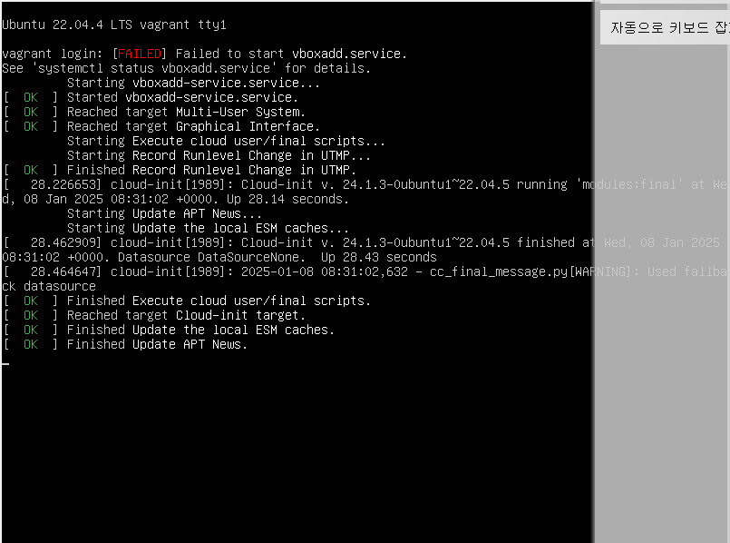

# Ubuntu 22.04 LTS 기반의 Vagrant box 주요 차이점 비교

| 비교 항목 | ubuntu/jammy64 | bento/ubuntu-22.04 |  
|:---|:---|:---|  
| 최소 메모리 | 1GB | 512MB |  
| 권장 메모리 | 2GB | 1GB |  
| 최소 CPU | 1 core | 1 core | 
| 권장 CPU | 2 cores | 2 cores | 
| 최소 디스크 | 10GB | 8GB | 
| 기본 이미지 크기 | ~500MB | ~350MB | 
| K8S 호환성 | 좋음 | 매우 좋음 | 
| VirtualBox 지원 | 제한적 | 우수 | 
| 업데이트 주기 | 분기별 | 월별  | 
| 커스터마이징 | 제한적 | 용이함 | 
| 성능 | 보통 | 좋음 | 
| 범용성 | 보통 | 높음 |  

### ubuntu/xenial64:
- 오래된 Ubuntu 버전으로 보안 업데이트 지원 종료
- 레거시 시스템 호환성
- 최신 K8S 버전과 호환성 문제

### ubuntu/jammy64:
- Canonical 공식 지원
- 보안 업데이트 우선 적용
- 최신 Ubuntu LTS
- 기본 Ubuntu 설정 유지
- 더 많은 기본 패키지 포함

### bento/ubuntu-22.04:
- Chef Software 관리로 안정성 높음
- 최적화된 이미지 크기
- 다양한 하이퍼바이저 지원 
- 커스터마이징이 용이

  